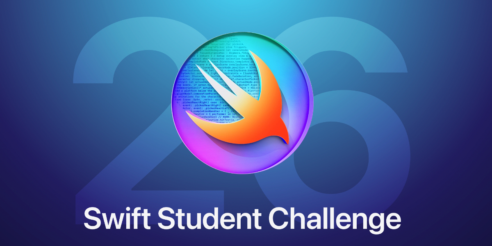

# WWDC 2026 - Swift Student Challenge

List of student submissions for the WWDC 2026 - Swift Student Challenge.

### How to add your submission?
1. [Click here](https://github.com/wwdc/2026/edit/main/Template.md) to fork this repository and edit the `Template.md` file.
2. Fill out the document based on the example in the comment below.
3. Make a new Pull Request and wait for the review.

#### How to update your submission?
If you would like to update your submission status please find your file in `Submission` directory. Edit file, update status and create Pull Request.

### Submissions

| Name | Source |    Video    | Technologies | Status |
|-----:|:------:|:-----------:|:-------------|:------:|
|[Manpreet Singh](https://www.linkedin.com/in/manpreet-swe/)|[GitHub](https://github.com/Manpreet-Singh-Kamboj/swift-student-challenge-2026)|-|SwiftUI, SceneKit, UIKit, Combine||
|Max Hillyer|[GitHub](https://github.com/Max-Hillyer/swipes)|-|SwiftUI, CoreLocation||
|[Tarun Abraham](https://www.linkedin.com/in/tarun-jacob-abraham)|[GitHub](https://github.com/Cookiesgobrr/EpilEducate)|-|SwiftUI, SpriteKit, UIKit||

##### Total: 3 | Awarded: 0
